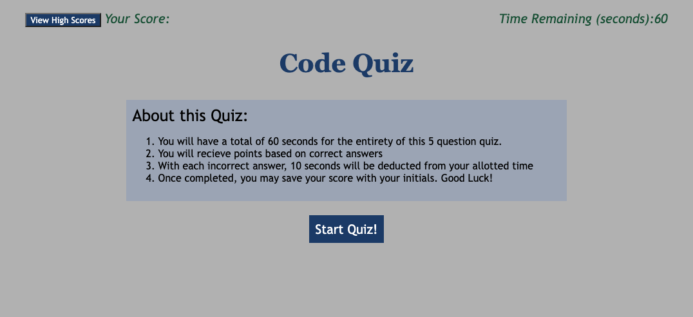

# code-quiz
Module 4 challenge: Web API's

## Information
User Story of this project: 
To create a timed quiz on JavaScript fundamentals that ultimately stores high scores

## Description
This webpage allows users to take a timed quiz over JS fundamentals. The concept involves answering a 60 second quiz of 5 questions. With each correct answer, your score is increased by a point. For each incorrect answers, 10 seconds will be deducted from the timer. In the end, you will be prompted to save your scores with your initials. 

## Assignment Submission notes: 
I am knowingly submitting an imcomplete assignment. The quiz is not taking off time for incorrect answers and is not saving submissions.  I plan on finishing this assignment to ensure all acceptance criteria is met

## Usage 
No downloads are necessitated to utilize this password generator. This is a deployed webpage application that may be used via any Web browser. 

## Links
You may access the deployed application at: 
https://shaffachaudhry.github.io/code-quiz/

you may access the repository at: 
https://github.com/shaffachaudhry/code-quiz

## Sources Utilized 
Multiple sources were used to help in the functionality of the website to include 
-Class Activities Module 4 Web API's
-https://www.freecodecamp.org/news/html-button-onclick-javascript-click-event-tutorial/
-https://developer.mozilla.org/en-US/docs/Web/HTML/Global_attributes/id
-https://stackoverflow.com/questions/26107125/cannot-read-property-addeventlistener-of-null
-https://www.youtube.com/watch?v=WUBhpSRS_fk&ab_channel=CodingNepal

## Mock Image
